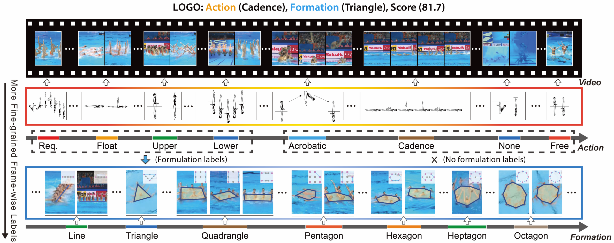
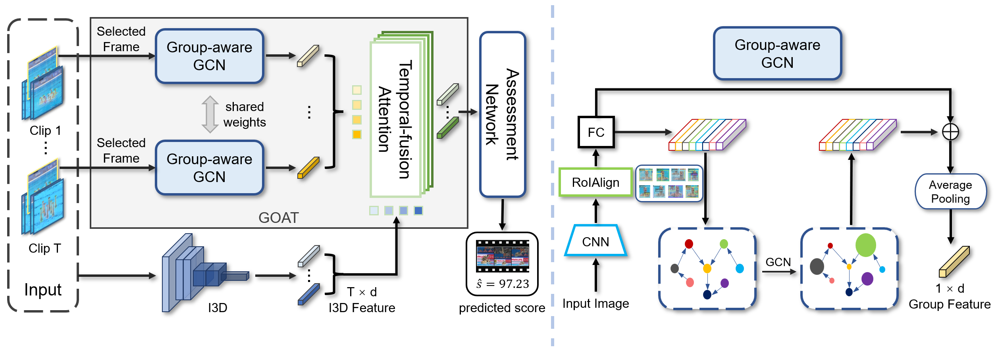
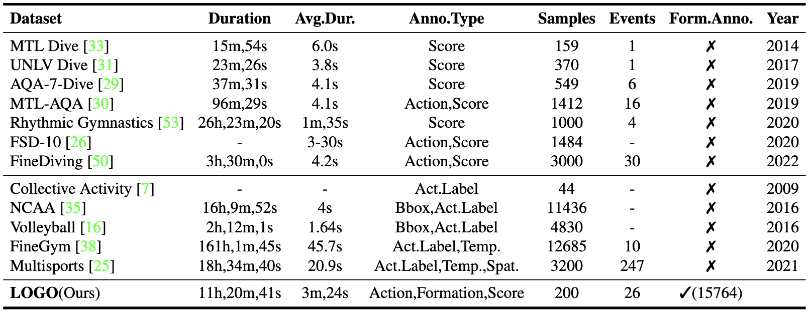
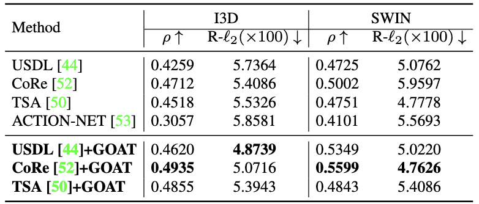

# <center>LOGO: A Long-Form Video Dataset for Group Action Quality Assessment (CVPR 2023)</center>
### <center>*[Shiyi Zhang](https://shiyi-zh0408.github.io/), [Wenxun Dai](https://github.com/Dai-Wenxun), Sujia Wang, Xiangwei Shen, [Jiwen Lu](http://ivg.au.tsinghua.edu.cn/Jiwen_Lu/), [Jie Zhou](https://scholar.google.com/citations?user=6a79aPwAAAAJ&hl=en&authuser=1), [Yansong Tang†](https://andytang15.github.io/)*</center>

#### <center>[[Paper]](https://openaccess.thecvf.com/content/CVPR2023/papers/Zhang_LOGO_A_Long-Form_Video_Dataset_for_Group_Action_Quality_Assessment_CVPR_2023_paper.pdf) [[Dataset]](https://pan.baidu.com/s/1GNi_ZcbSq6oi2SEX_iuFwA?pwd=v329) (extract number: v329)</center>

This repository contains the LOGO dataset and PyTorch implementation for the paper "LOGO: A Long-Form Video Dataset for Group Action Quality Assessment" (CVPR 2023)

---

## 💡 LOGO Dataset and GOAT Pipeline



***LOGO*** is a multi-person long-form video dataset with frame-wise annotations on both **action procedures** (as shown in the second line) and **formations** (as shown in the third line, which reflects relations among actors) based on artistic swimming scenarios. It also contains **score** annotations for AQA.




 ***GOAT*** (short for GrOup-aware ATtention)

## 📋 To-Do List

- [x] Release the dataset
- [x] The code of GOAT
- [x] Pretrained features for LOGO

## :books: Dataset

### 🗒️ Lexicon

***LOGO*** is organized by temporal structure, which contains **action and formation** manual annotations. Herein, we design the labeling system with professional artistic swimming athletes to construct a lexicon for annotation, considering [FINA rules](https://www.worldaquatics.com/artistic-swimming/rules) and the actual scenario of the competitions. In the *Technical* event, the group size is eight people, the video length is $170±15s$, and the actions include *Upper*, *Lower*, *Float*, *None*, *Acrobatic*, *Cadence*, and five *Required Elements*. Each competition cycle needs to complete five *Required Elements*, at least two *Acrobatic* movements, and at least one *Cadence* action. In the *Free* events, there are 8 people, the video length is $240±15s$, and the actions include *Upper*, *Lower*, *Float*, *None*, *Acrobatic*, *Cadence*, and *Free* elements. When performing *Required*, *Upper*, *Lower*, and *Float*, the athletes form neat polygons.

### :pen: Annotation

Given an RGB artistic swimming video, the annotator utilizes our defined lexicon to label each frame with its action and formation. We accomplish the 25fps frame-wise **action annotation** stage utilizing the [COIN Annotation Toolbox](https://github.com/coin-dataset/annotation-tool) and the 1fps frame-wise **formation labels** using [Labelme](https://github.com/wkentaro/labelme). Specifically, we set strict rules defining the boundaries between artistic swimming sequences and the formation marking position and employ eight workers with prior knowledge in the artistic swimming domain to label the dataset frame by frame following the rules. The annotation results of one worker are checked and adjusted by another, which ensures annotation results are double-checked. 

The annotation information is saved in [[Baidu Drive]](https://pan.baidu.com/s/1UwlGzCeq_UjY0GbOnaHXxw?pwd=ojgf) (extract number: ojgf)

The annotation information contained in `anno dict.pkl` for each sample is:

| List Num. | Type   | Description                       | Example                       |
| --------- | ------ | --------------------------------- | ----------------------------- |
| `0`       | string | Event type.                       | 'tech'                        |
| `1`       | float  | The score of the video.           | 90.25                         |
| `2`       | float  | /                                 | /                             |
| `3`       | list   | End frame of the action instance. | [76, 141, 187, 246, 263, ···] |
| `4`       | list   | Action type of each frame.        | [12, 12, 12, 12, 12, ···]     |

### :chart_with_upwards_trend: Statistics



The LOGO dataset consists of 200 video samples from 26 events with 204.2s average duration and above 11h total duration, covering 3 annotation types, 12 action types, and 17 formation types.

### 💾 Download

- Video_Frames:  [[Baidu Drive]](https://pan.baidu.com/s/1GNi_ZcbSq6oi2SEX_iuFwA?pwd=v329) (extract number: v329) 
- Annotations and Split: [[Baidu Drive]](https://pan.baidu.com/s/1UwlGzCeq_UjY0GbOnaHXxw?pwd=ojgf) (extract number: ojgf)

### :notebook: Data Preparation

- The prepared dataset ([[Baidu Drive]](https://pan.baidu.com/s/1GNi_ZcbSq6oi2SEX_iuFwA?pwd=v329) (extract number: v329) ) and annotations ([[Baidu Drive]](https://pan.baidu.com/s/1UwlGzCeq_UjY0GbOnaHXxw?pwd=ojgf) (extract number: ojgf)) are already provided in this repo. 

- The data structure should be:

```
$DATASET_ROOT
├── LOGO
|  ├── WorldChampionship2019_free_final
|     ├── 0
|        ├── 00000.jpg
|        ...
|        └── 06249.jpg
|     ...
|     └── 11
|        ├── 00000.jpg
|        ...
|        └── 06249.jpg
|  ...
|  └── WorldChampionship2022_free_final
|     ├── 0
|     ...
|     └── 7 
└──
```

### 

## 💻 Code for Group-aware Attention (GOAT)

### ⭐️ Performance



### ⚙️ Pretrain Model

The Kinetics pretrained I3D downloaded from the reposity [kinetics_i3d_pytorch](https://github.com/hassony2/kinetics_i3d_pytorch/blob/master/model/model_rgb.pth)

```
model_rgb.pth
```

### 🗂️ Requirement

- torch_videovision

```
pip install git+https://github.com/hassony2/torch_videovision
```

### 📊 Training

**USDL + GOAT + I3D**

```
cd ./MUSDL-GOAT/MTL-AQA
python main.py --lr=7e-06 --weight_decay=0.001 --use_i3d_bb=1 --use_swin_bb=0
```

**USDL +GOAT + Video Swin-Transformer**

```
cd ./MUSDL-GOAT/MTL-AQA
python main.py --lr=1e-05 --weight_decay=0.0001 --use_i3d_bb=0 --use_swin_bb=1
```

**CORE + GOAT + I3D**

```
cd ./CoRe-GOAT/MTL-AQA
python main.py --lr=1e-06 --warmup=0 --use_i3d_bb=1 --use_swin_bb=0 --bs_train=2 --weight_decay=1e-5
```

**CORE + GOAT + Video Swin-Transformer**

```
cd ./CoRe-GOAT/MTL-AQA
python main.py --lr=3e-07 --warmup=0 --use_i3d_bb=0 --use_swin_bb=1 --bs_train=1 --weight_decay=1e-5
```

## 📧 **Contact**

E-mail:  [shiyi-zh19@mails.tsinghua.edu.cn](mailto:shiyi-zh19@mails.tsinghua.edu.cn)

WeChat: ZSYi-408
